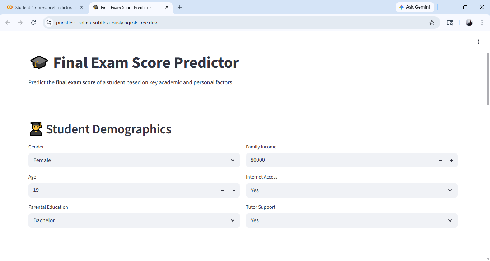
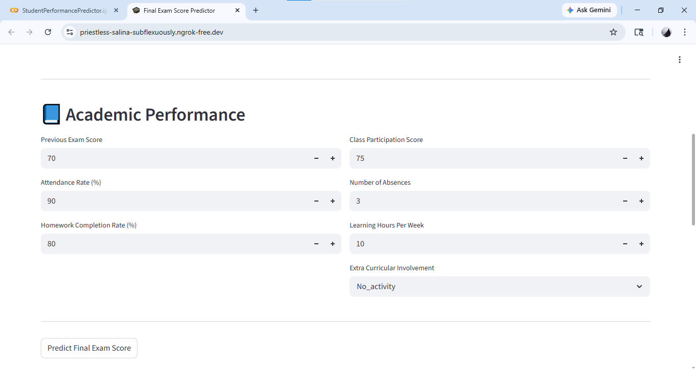
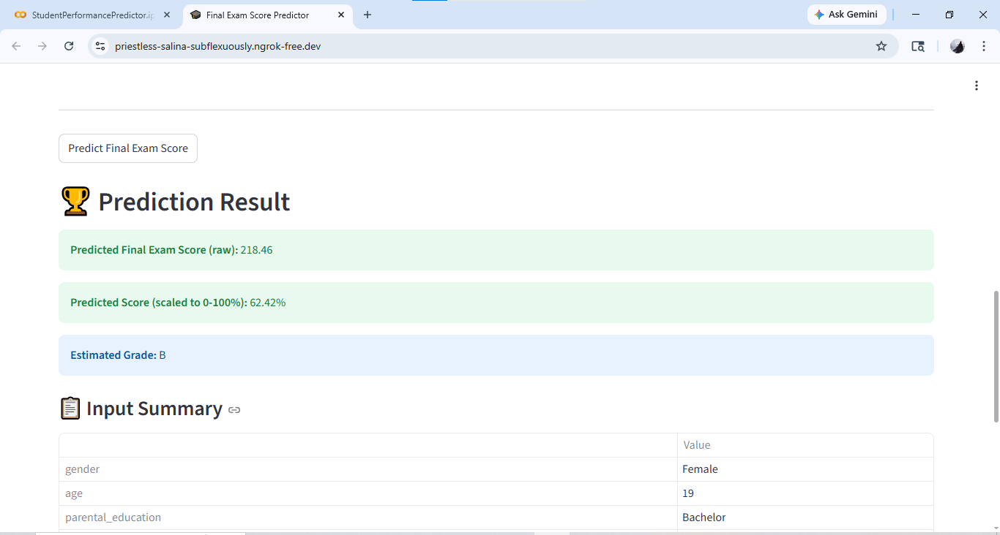
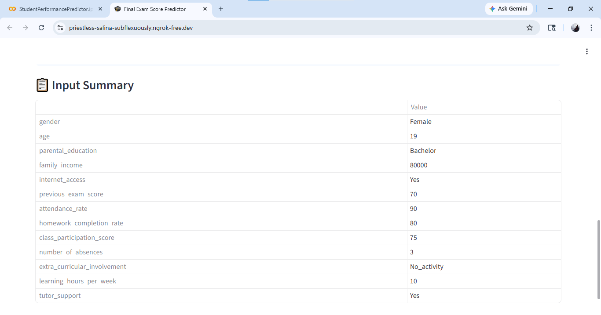

# 📘 Student Performance Prediction

A Machine Learning-based web application that predicts a student's final exam score based on academic, demographic, and behavioral factors.

This project was developed as part of the **YBI Foundation Internship** and enhanced with an interactive **Streamlit web app** for real-time predictions.

## 🧠 Project Overview

This system analyzes various student-related inputs such as:
- Academic performance
- Attendance
- Study habits
- Socio-economic factors  

and predicts:
- Final Exam Score  
- Scaled Percentage  
- Estimated Grade  

---

## ⚙️ Tech Stack

- Python  
- Pandas  
- Scikit-learn  
- Streamlit  
- NumPy  
- Joblib  

---

## ✨ Features

- 📊 Predict final exam score using ML model  
- 🎯 Displays:
  - Raw predicted score  
  - Scaled percentage (0–100%)  
  - Estimated grade  
- 🧾 Input summary for user verification  
- 🌐 Interactive Streamlit UI  
- 🔄 Handles preprocessing & encoding  
- 📈 Model evaluation using MAPE  

---

## 📊 Dataset Features

| Feature | Description |
|--------|------------|
| gender | Student's gender |
| age | Student's age |
| parental_education | Parent's education level |
| family_income | Monthly income |
| internet_access | Internet availability |
| previous_exam_score | Previous exam marks |
| attendance_rate | Attendance (%) |
| homework_completion_rate | Homework completion (%) |
| class_participation_score | Participation score |
| number_of_absences | Total absences |
| extra_curricular_involvement | Activity level |
| learning_hours_per_week | Weekly study hours |
| tutor_support | Tutoring support |
| final_exam_score | Target variable |

---

## 📈 Model Performance

- Model: Linear Regression  
- MAPE: 5.7%  
- Accuracy: ~94.3%  

---

## 🖥️ Web App Screenshots

### 🏠 Homepage & Input Form




### 📊 Prediction Results


### 🧾 Input Summary



---
## 📁 Project Structure

```bash
Student-Performance-Prediction-YBI/
│
├── StudentPerformancePredictor.ipynb   # Model training notebook
├── Student Performance Predictor for EduQuest Coaching.csv  # Dataset
├── images/                             # Screenshots for README
│   ├── home.png
│   ├── result.png
│   └── summary.png
└── README.md                           # Project documentation
```
